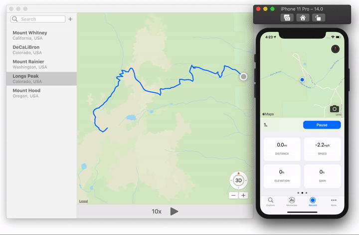

# Teleport

Xcode's built in location simulation is great but it could be better. Teleport gives you more control over path simulation.

## Features
- GPX file management
- Play/Pause/Stop simulations
- Speed controls

## Author
Hi I'm [Cameron Deardorff](https://twitter.com/camdeardorff). Usually I'm working on [Landscape](https://getlandscape.app) or other developer tools like this one.

## Contributing
Feel free to add a pull request or open an issue. Contributions to this project are very appreciated. 

## You may also like
- [CoreGPX](https://github.com/vincentneo/CoreGPX), A library for parsing and creation of GPX location files. Purely Swift.
- [set-simulator-location](https://github.com/lyft/set-simulator-location), CLI for setting location in the iOS simulator.

## Licence
Teleport is available under the MIT license. See the LICENSE file for more info.